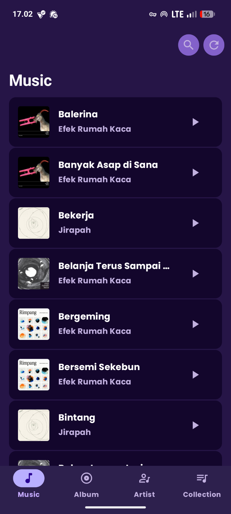
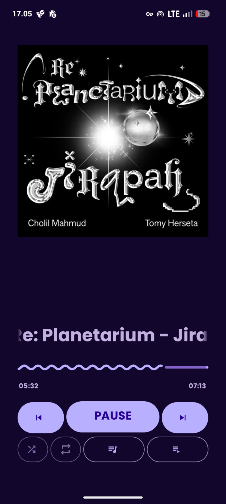
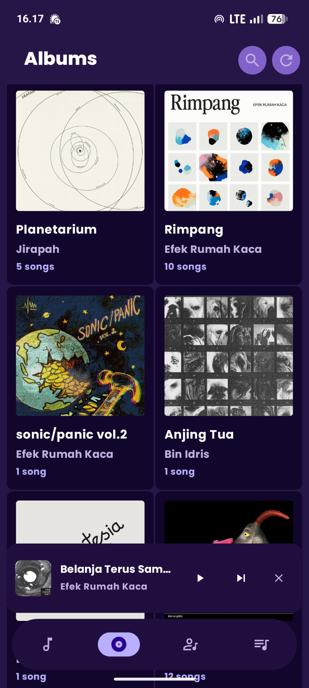

[](https://github.com/felle-dev/fusic-app/releases)
[](https://developer.android.com)
[](LICENSE)

**[Fusic](https://github.com/felle-dev/fusic-app)** is a sleek and intuitive music player app that lets you enjoy your local music collection with a beautiful **Material 3** design. Experience seamless playback, dynamic theming, and full control over your music—all in one app.

[](https://github.com/felle-dev/fusic-app/releases)

## **Features**

- **Local Music Playback** – Play music directly from your device’s storage
- **Material 3 Design** – Modern, clean interface with dynamic color theming
- **Full Player Controls** – Play, pause, skip, shuffle, and repeat with ease
- **Background Playback** – Keep the music going with notification controls
- **Lightweight & Fast** – Optimized for performance and smooth navigation

## **Screenshots**

<div style="display: flex; justify-content: space-around; gap: 10px;">
  
  
  
</div>

## **Tech Stack**

- **Language:** Java
- **UI:** XML Layouts
- **Design:** Material 3 with Dynamic Colors
- **Media:** MediaPlayer & MediaSession
- **Architecture:** Native Android

## **Getting Started**

### **Prerequisites**
- [Android Studio](https://developer.android.com/studio) (latest stable version)
- Android device or emulator (API 24+)

### **Installation**
1. Clone the repository:
   ```bash
   git clone https://github.com/felle-dev/fusic-app.git
   cd fusic-app
   ```
2. Open the project in **Android Studio**.
3. Build and run the app.
4. Grant **storage permissions** to access your music files.

## **Contributing**
Contributions make the open-source community thrive! Feel free to:
- Fork the project
- Open issues for bugs or feature requests
- Submit pull requests with improvements

## **Translations**
Fusic is currently available in **English**. Help us add more languages by opening an issue or submitting a pull request with translation files.

## **Support**
If you enjoy Fusic, consider:
- Starring the repository
- Reporting bugs or suggesting features
- Sharing Fusic with friends and family
- Contributing to the codebase

## **License**
This project is licensed under the **GNU General Public License v3.0**. See the [LICENSE](LICENSE) file for details.

[release-badge]: https://img.shields.io/github/v/release/felle-dev/fusic-app?style=for-the-badge
[flutter-badge]: https://img.shields.io/badge/Flutter-02569B?style=for-the-badge&logo=flutter&logoColor=white
[license-badge]: https://img.shields.io/github/license/felle-dev/fusic-app?style=for-the-badge
